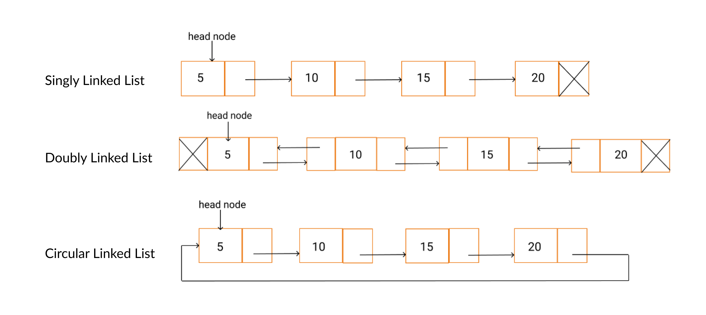

# 💡 Linked list

## 🍃 ايش الـ Linked List ؟
هي طريقة نخزن فيها البيانات بس مش متل المصفوفة بدل ما نخزن العناصر ورا بعض في اذاكرة كل عنصر بكون مربوط 
باللي بعده بواسطة رابط Pointer

---

## 🍃 الفرق بين arraylist , linked list
 الـ Array  بتخزن العناصر بمكان متجاور (contiguous)
 الـ Linked List بتخزن كل عنصر بشكل منفصل، وكل عنصر بيكون فيه رابط (pointer) بأشر على العنصر اللي بعده.

---

كل عنصر يسمى **Node** ويحتوي على:
- **Data:** القيمة المخزنة.
- **Next:** مؤشر يشير إلى العنصر التالي.

<pre> text [ Data | Next ] → [ Data | Next ] → [ Data | null ]  </pre>

  ---

## 🧱 أنواع Linked List:
### 1: Singly Linked List
→ كل Node بيأشر بس على اللي بعده.
<pre> text [ Data | Next ] → [ Data | Next ] → [ Data | null ]  </pre>

### 2:  Doubly Linked List

→ كل Node بيأشر على اللي قبله واللي بعده.
<pre> null ← [prev | data | next] ↔ [prev | data | next] ↔ [prev | data | next] → null </pre>

### 3: Circular Linked List
→ آخر Node بيأشر على أول واحد (بدون null بالنهاية). 
- Circular Singly :
كل Node بأشر بس على اللي بعده، وآخر Node بأشر على أول واحد بدل ما يكون null.
  <pre> [ Data | Next ] → [ Data | Next ] → [ Data | Next ] 
        ↑                                      ↓
        └───────────────←←←←←←←←←←←←────────────┘   </pre>

- Circular Doubly
 هون كل Node بيحتوي على مؤشرين:
واحد باشر إلى اللي قبله
وواحد بأشر إلى اللي بعده
وبرضو، أول Node بأشر على الأخير والعكس.
  <pre> null ←→ [ Data | Prev | Next ] ←→ [ Data | Prev | Next ] ←→ [ Data | Prev | Next ] ←→
           ↑                                                            ↓
           └────────────────────←←←←←←←←←←←←←←←←←←←←────────────────────┘    </pre>

---

## 🧠 ليش نستخدم Linked List؟

### ✅ المميزات:
مرونة في حجم البيانات.
الإضافة والحذف أسرع من الـ array (بخاصة من البداية أو الوسط).
ما في مشكلة (reallocating).

### ❌ العيوب:
ما بنقدر نصل للعناصر مباشرة (لا يوجد index مثل الـ array).
استهلاك أكبر للذاكرة (بسبب الـ pointers).
أبطأ بالبحث عن العناصر

---

## 🍃عمليات ع linked list

### ⭐ add first :
<pre>
public class linkedlist {
Node head ;
public linkedlist {
public linkedlist (Object data ){
this.head = new node (data):}
public boolean addfirst(Object data ){
if (head == null){
head = new Node (data):}}  </pre>
لو بدي اعمل node جديد واخلي ال headياشر عليها بدل القديمة 
<pre>
Node newnode = new Node (data);
newnode.setNext(head);
head = newnode;
return true. </pre>
ليش خليت node2 تاشر على node1 قبل ما انثل ال head ؟
لانه رح يصير ما في مؤشر ع node1 بالتالي رح تضيع البيانات  
-----

### ⭐ add last:
بدنا نضيف node بالاخير  يعني تكون تاشر ع null فلازم اعمل نود جديدة تاشر ع null  و اخلي ال node القبل الاخيرة تاشر عليها كيف؟  فلازم اعمل مؤشر ياشر ع النود القبل الاخير  بس انا ما عندي الا مؤششر واحد الي هو ال head وانا  
ما بنفع احركه من مكانه طيب شو الحل ؟ لازم اعمل نسخة منه ولو سميتها ع سبيل المثال temp بتكون تاشر ع نفس المكان الي باشر عليه ال head 

<pre>
  public boolean addlast (Object data ){
  if (head == null){
  head = new Node (data)
  return true;
</pre>
بهاي الحالة بتاكد اذا  القائمة فاضية او لاء واذا فاضية بعمل node 
<pre>
  Node w = new Node (data):
  Node temp = head;
  while(temp.getNext()!=null){
  temp= temp.getNext():
</pre>
هون بتاكد اذا النود الي بعد ال temp اذا بتاشر ع null او لاء  اذا لاء بحرك ال temp للي بعدها  لحد ما ياثر ع null وبطلع من اللوب 
<pre>
  temp.setNext(w);
  return true;}}
</pre>

### ⭐ add By Index :
بتحاول تضيف نود جديدة بمكان معيّن (حسب الـ index) جوا اللينكد ليست.
بتتأكد إذا القائمة فاضية → ما بزبط تضيف → false.
بتمشي نود نود لحد ما توصل للمكان المطلوب.
إذا ما وصلت → false.
إذا وصلت:
بتربط النود الجديدة بالنود اللي بعدها.
وبتربط اللي قبلها بالنود الجديدة.
بترجع true إذا تمت العملية.
<pre>
public boolean addByIndex (Object data , int index) {
if(head == null) {
return false;
}
Node temp = head;
Node newNode = new Node(data);
while (index > 0 && temp != null) {
temp = temp.getNext();
index--;
}
if(index != 0) {
return false;
}
newNode.setNext(temp.getNext());
temp.setNext(newNode);
return true;
}</pre>

### ⭐ remove first :
 بتشيل أول عنصر من الـ Linked List. أول إشي بتتأكد إذا القائمة فاضية، بترجع null.
 إذا مش فاضية، بتخزّن أول نود مؤقتًا، بعدين بتحرك الـ head للنود اللي بعدها، وبهالطريقة بتكون شالت أول عنصر من السلسلة.
 وبترجع البيانات (data) اللي كانت فيه. هاي الطريقة مفيدة لما بدك تمسح أول عنصر وتعرف شو كان مخزن فيه.
<pre>
  public Object removeFirst() {
if(head == null) {
return null;
}
Node temp = head;
head= head.getNext( );
return temp.getData();
}
</pre>

### ⭐ remove last :
 بتشيل آخر عنصر من القائمة. أول إشي بتتأكد إذا القائمة فاضية، بترجع null. بعدين بتمشي خطوة خطوة لحد ما توصل للنود اللي قبل الأخيرة، وبتخزّن الأخيرة بمتغير. بعدين بتقطع الرابط بين النود اللي قبل الأخيرة واللي بعدها (يعني بتحذف الأخيرة)، وبترجع البيانات (data) اللي كانت فيها. هيك بتكون شالت آخر عنصر ورجعت قيمته.
<pre>
  public Object removeLast() {
if(head == null) {
return null;
}
Node temp = head;
while (temp.getNext().getNext() != null) {
temp = temp.getNext();
}
Node tD = temp.getNext();
tD.setNext(null);
return tD.getData();
}
</pre>

### ⭐ remove by index :
بتحذف عنصر من موقع معيّن داخل الـ Linked List حسب رقم الـ index. أول إشي بتتأكد إذا القائمة فاضية، بترجع null. بعدين بتمشي خطوة خطوة على النودات لحد ما توصل للمكان المطلوب، وبتحتفظ بوحدة قبلها. إذا وصلت صح، بتخلي النود اللي قبلها تاشر على اللي بعد العنصر اللي بدنا نشيله، وهيك بنكون حذفنا العنصر وربطنا اللي قبله باللي بعده. بترجع البيانات (data) اللي كانت بالنود اللي انحذفت.
<pre>
public Object removeByIndex(int index) {
if(head == null) {
return null;
}
Node temp = head;
Node tempPre = null;
while (index > 0 && temp != null) {
tempPre = temp;
temp = temp.getNext();
index--;
}
if(index != 0) {
return null ;
}
tempPre.setNext(temp.getNext());
return temp.getData();
}</pre>

### ⭐ Access :
بتوصل للعنصر بالرقم اللي بتعطيه (index) عن طريق التنقل بين النودات . إذا ما وصلته بترجع null، وإذا وصلته بترجع قيمته.
<pre>
public Object get(int index) {
Node temp = head;
while (index > 0 && temp != null) {
temp = temp.getNext();
index--;
}
if(index != 0) {
return null ;
}
return temp.getData();
}</pre>

 ----
 
## 🍃 متى استخدم arraylist ومتى linkedlist 
لو بدك توصّل لعناصر بسرعة وبشكل عشوائي، وتعدّل غالباً بنهاية القائمة، استخدم ArrayList لأنها أسرع بالوصول وبتستخدم ذاكرة متجاورة.
أما إذا كنت بتضيف وتحذف كثير خصوصاً في بداية أو وسط القائمة، أو حجم البيانات بتغير كتير، فاستخدم Linked List لأنها أسهل بتعديل العناصر بدون الحاجة لتحريك باقي العناصر، بس الوصول فيها بطيء شوي لأنها بتمشي عنصر ورا عنصر.

## لو وصلتو لهون قيمولي الوضع ع الانستا ... بالتوفيق 
