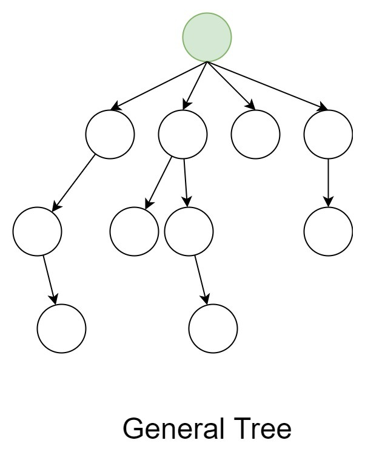
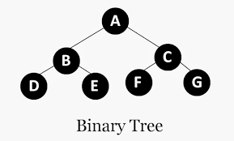
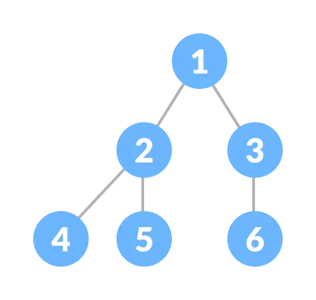
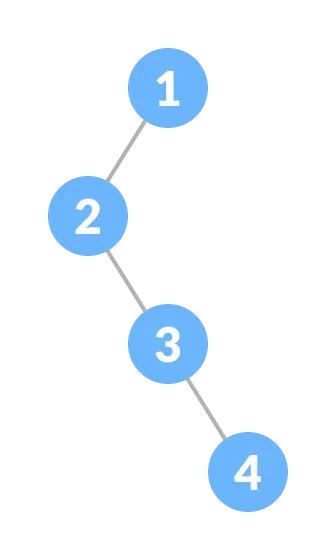

# 💡Tree

## 🍃 شو يعني tree ؟
أمثل الـ Data ع شكل node وكل node بنبثق منها مجموعة من الـ nodes  
A tree is a hierarchical, non-linear data structure.

---
## 🍃 ليش اسمها TREE ؟ 
لانه شكلها فعليا متل الشجرة 
Root / Branches / Leaves

---

## 🍃 مصطلحات اساسية لازم تكون بتعرفها 

### ⭐ Root (الجذر)

أول (Node) بالشجرة.

منها ببدا كل إشي.

ما إلها اب (Parent).

### ⭐ Node (العقدة)

وحدة أساسية في الشجرة.

بتحتوي على قيمة (Data).

ممكن يكون إلها أبناء (Children).

### ⭐ Parent (الأب)

كل node إلها parent واحد (ما عدا الـ Root).

### ⭐ Child (الإبن)

node متصلة مباشرةً parent .

### ⭐ Leaf (ورقة)

node ما إلها children 

### ⭐ Siblings (إخوة)

node إلها نفس parent.

### ⭐ Height (الارتفاع)

أطول مسار من الـ Root ل leaf.

### ⭐ Depth (العمق)

عدد الحواف (Edges) من الـ Root ل node معيّنة

### ⭐ Subtree (شجرة فرعية)

أي node مع كل children تحتها تعتبر Subtree.

---

## 🍃 Types of trees

### ⭐ General Tree 

أي عقدة ممكن يكون إلها عدد غير محدود من الأبناء.]

### ⭐ Binary Tree 

كل عقدة مسموح إلها حد أقصى ولدين (Left + Right).

أكثر نوع مشهور بالداتا ستركتشور.

#### Full Binary Tree
كل عقدة (Node) فيها يا إمّا 0 أبناء أو 2 أبناء.

يعني ما في عقدة عندها ابن واحد فقط

####  Perfect Binary Tree
كل المستويات مليانة 100%.

جميع الأوراق (Leaves) موجودة بنفس المستوى.

#### Complete Binary Tree
كل المستويات مليانة بالعقد.

المستوى الأخير ممكن يكون ناقص، لكن لازم يتعبّى من اليسار لليمين.

#### skewe Binary Tree

كل عقدة فيها ابن واحد فقط (يا إما كلهن left child أو كلهن right child).

#### Degenerate Binary Tree

كل عقدة فيها ابن واحد فقط (يا  left child أو  right child).

####  Binary Search Tree (BST)

القيم الأصغر من قيمة العقدة → موجودة بالـ Left Subtree.

القيم الأكبر من قيمة العقدة → موجودة بالـ Right Subtree.

بخلي البحث أسرع. كيف يعني ؟  

يعني لو بدي ابحث عن رقم 12 بشوف root و بفحصه اذا اكبر منه بروح ع اليمين وبنسى اليسار وهيكك قللت وقت و اوجدت العنصر بسرعة 

## implementation of BST 
### Traversal :

#### Pre order

#### in order

#### post order

### pre order :

 #### Root -> left -> Right

### in order:

#### left -> Root -> Right

### Post order :

#### leaf -> Right -> Root 
 

### ⭐ Balanced Trees (متل  AVL, Red-Black Tree)

أشجار ثنائية بس متوازنة حتى ما يصير ميلان لطرف واحد.

مفيدة بالبحث السريع.

نوع خاص من Binary Tree يستخدم بعمليات الـ Priority Queue.

