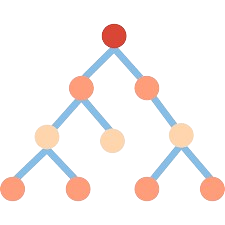
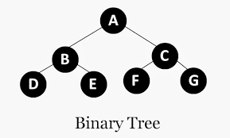
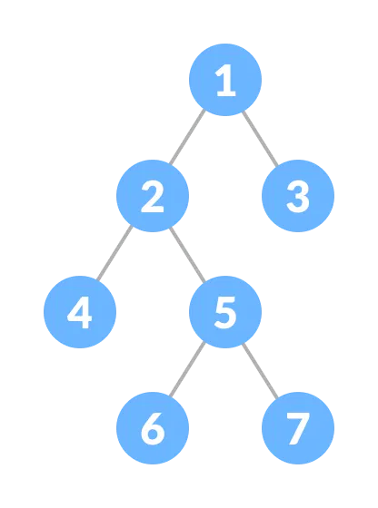
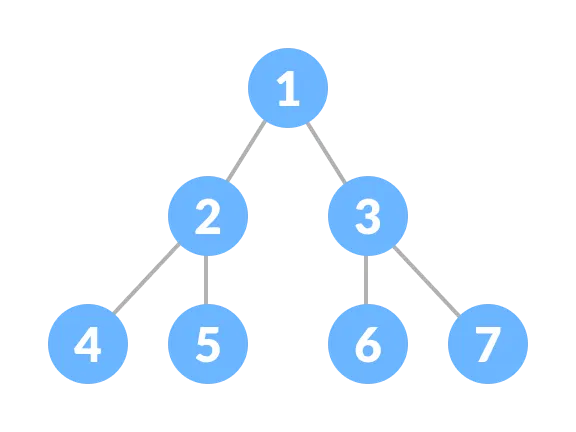
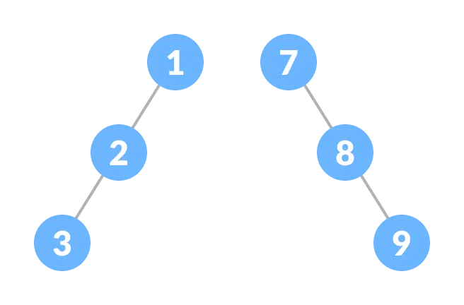
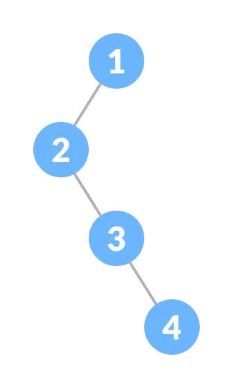
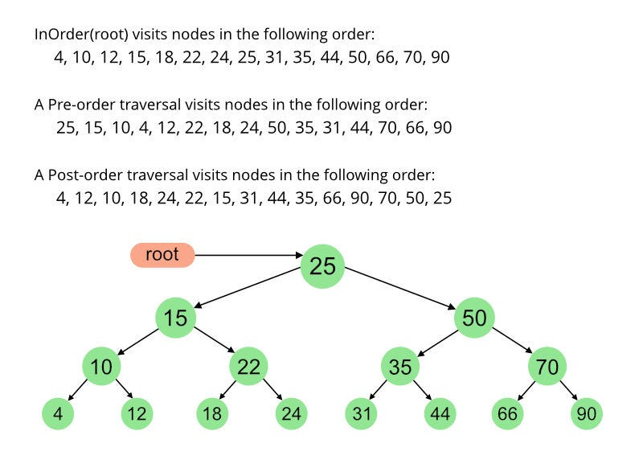

# 💡Tree

## 🍃 شو يعني tree ؟
أمثل الـ Data ع شكل node وكل node بنبثق منها مجموعة من الـ nodes  
A tree is a hierarchical, non-linear data structure.

---
## 🍃 ليش اسمها TREE ؟ 

لانه شكلها فعليا متل الشجرة 

Root / Branches / Leaves

---

## 🍃 مصطلحات اساسية لازم تكون بتعرفها 

### ⭐ Root (الجذر)

أول (Node) ب Tree .

منها ببدا كل إشي.

ما إلها اب (Parent).

### ⭐ Node (العقدة)

وحدة أساسية في Tree.

بتحتوي على قيمة (Data).

ممكن يكون إلها أبناء (Children).

### ⭐ Parent (الأب)

كل node إلها parent واحد (ما عدا الـ Root).

### ⭐ Child (الإبن)

ال node متصلة مباشرةً parent .

### ⭐ Leaf (ورقة)

ال node ما إلها children 

### ⭐ Siblings (إخوة)

ال node إلها نفس parent.

### ⭐ Height (الارتفاع)

أطول مسار من الـ Root ل leaf.

### ⭐ Depth (العمق)

عدد الحواف (Edges) من الـ Root ل node معيّنة

### ⭐ Subtree (شجرة فرعية)

أي node مع كل children تحتها تعتبر Subtree.

---

## 🍃 Types of trees :

### ⭐ General Tree 

أي node ممكن يكون إلها عدد غير محدود من children.

### ⭐ Binary Tree 

كل node  مسموح إلها حد أقصى 2children  (Left + Right).

أكثر نوع مشهور بالداتا ستركتشور.

#### 🔹Full Binary Tree
كل Node فيها يا إمّا 0 children أو 2 children.

يعني ما في node عندها child واحد فقط

#### 🔹Perfect Binary Tree
كل المستويات مليانة 100%.

جميع الأوراق (Leaves) موجودة بنفس ال levels.

#### 🔹Complete Binary Tree
كل levels مليانة nodes .

ال level الأخير ممكن يكون ناقص، لكن لازم يتعبّى من اليسار لليمين.

#### 🔹skewe Binary Tree

كل node فيها child واحد فقط (يا إما كلهن left child أو كلهن right child).

#### 🔹Degenerate Binary Tree

كل node فيها child واحد فقط (يا  left child أو  right child).

#### 🔹Binary Search Tree (BST)

القيم الأصغر من قيمة node -> موجودة بالـ Left Subtree.

القيم الأكبر من قيمة العقدة -> موجودة بالـ Right Subtree.

بخلي البحث أسرع  كيف يعني ؟  

يعني لو بدي ابحث عن رقم 12 بشوف root و بفحصه اذا اكبر منه بروح ع اليمين وبنسى اليسار وهيكك قللت وقت و اوجدت العنصر بسرعة 

## 🍃 implementation of BST :

### 🗯 Traversal :

كيف أمر ع كل node في ال tree

### 🔸pre order :

 #### Root -> left -> Right

<pre>
 class Node {
    int data;
    Node left, right;

    Node(int value) {
        data = value;
        left = right = null;
    }
}

class BinaryTree {
    Node root;
    void preorder(Node node) {
        if (node == null) {
            return;
        }
        System.out.print(node.data + " "); 
        preorder(node.left);            
        preorder(node.right);             
    }

    public static void main(String[] args) {
        BinaryTree tree = new BinaryTree();
        tree.root = new Node(1);
        tree.root.left = new Node(2);
        tree.root.right = new Node(3);
        tree.root.left.left = new Node(4);
        tree.root.left.right = new Node(5);
        System.out.println("Preorder traversal of tree:");
        tree.preorder(tree.root);
    }
}
 
</pre>

شرح الكود :
الكود عبارة عن (Binary Tree)**، وبداخلها ** (Node)** كل وحدة فيها:

- **قيمة (data)**
- **فرع يسار (left)**
- **فرع يمين (right)**

### إدخال عنصر جديد - Insert
  - إذا tree **فاضية (empty)**  العنصر بصير **(root)**
  - إذا tree مش فاضية -> نقارن مع root :
  - إذا القيمة أصغر -> نروح على **(left subtree)**
  - إذا القيمة أكبر -> نروح على **(right subtree)**

نكمل العملية لحد ما نلاقي مكان فاضي ونضيف node الجديدة.

ال **preOrderTraversal** بتزور العقد بالترتيب:

1.  (**Root**)  
2. (**Left Subtree**)  
3. (**Right Subtree**)

   
-----

### 🔸in order:

#### left -> Root -> Right

<pre>

 class Node {
    int data;
    Node left, right;
    Node(int value) {
        data = value;
        left = right = null;
    }
}
class BinaryTree {
    Node root;
    void inorder(Node node) {
        if (node == null) {
            return; }
        inorder(node.left);
        System.out.print(node.data + " ");  
        inorder(node.right);     
    }
    public static void main(String[] args) {
        BinaryTree tree = new BinaryTree();
        tree.root = new Node(1);
        tree.root.left = new Node(2);
        tree.root.right = new Node(3);
        tree.root.left.left = new Node(4);
        tree.root.left.right = new Node(5);

        System.out.print("Inorder Traversal: ");
        tree.inorder(tree.root);
    }
}

</pre>

### 🔸Post order :

#### leaf -> Right -> Root 

<pre>
class Node {
    int data;
    Node left, right;

    Node(int value) {
        data = value;
        left = right = null;
    }
}
class BinaryTree {
    Node root;

    void postOrder(Node node) {
        if (node == null) {
            return;
        }
        postOrder(node.left);
        postOrder(node.right);
        System.out.print(node.data + " ");
    }

    void postOrderTraversal() {
        postOrder(root);
    }
}
public class Main {
    public static void main(String[] args) {
        BinaryTree tree = new BinaryTree();
        tree.root = new Node(1);
        tree.root.left = new Node(2);
        tree.root.right = new Node(3);
        tree.root.left.left = new Node(4);
        tree.root.left.right = new Node(5);

        System.out.println("Postorder traversal:");
        tree.postOrderTraversal();
    }
}

</pre>

---

### 🗯 insert :

[شاهد الفيديو](image/insert.mp4)

 يعني كيف نضيف قيمة جديدة بالـ Binary Search Tree ونخليها محافظة على القاعدة الأساسية:

القيم الأصغر من node تروح على اليسار.

القيم الأكبر من node تروح على اليمين.

#### 📌 خطوات الإدخال (Insert):

- اذا tree فاضية -> العنصر الجديد بصير (root).

- اذا القيمة أصغر من قيمة root -> بروح للجهة اليسار.

- اذا القيمة أكبر من قيمة root -> بروح للجهة اليمين.

بنكرر الخطوات لحد ما نوصل لمكان فاضي (null) ونحط ال node الجديدة.

<pre>
 class Node {
    int data;
    Node left, right;

    Node(int value) {
        data = value;
        left = right = null;
    }
}

class BinarySearchTree {
    Node root;

    void insert(int value) {
        root = insertRec(root, value);
    }

    Node insertRec(Node root, int value) {
        if (root == null) {
            root = new Node(value);
            return root;
        }
        if (value < root.data) {
            root.left = insertRec(root.left, value);
        }
        else if (value > root.data) {
            root.right = insertRec(root.right, value);
        }
        return root; 
    }

    void inorder(Node root) {
        if (root != null) {
            inorder(root.left);
            System.out.print(root.data + " ");
            inorder(root.right);
        }
    }
}

public class Main {
    public static void main(String[] args) {
        BinarySearchTree bst = new BinarySearchTree();
        bst.insert(50);
        bst.insert(30);
        bst.insert(70);
        bst.insert(20);
        bst.insert(40);
        bst.insert(60);
        bst.insert(80);
        bst.inorder(bst.root);
    }
}

        50
       /  \
     30    70
    / \   / \
   20 40 60 80

</pre>
 
---

### 🗯 Search :

[شاهد الفيديو](image/search.mp4)

بنبدا من root  اذا القيمة الي بدنا اياها نفسها ال root فتمام 
اذا لاء بنشوف القيمة الي بعدها اذا اكبر منها بنروح يمين والا يسار لحد ما نوصل للقيمة الي بدنا اياها 

---

### 🗯 Delete :

[شاهد الفيديو](image/delete.mp4)

يعتمد الحذف على **ع عدد children ل node ** اللي بدنا نحذفها:

- **لو node بلا children:**  
  بنحذفها على طول وما في مشاكل.  

- **لو node الها child واحد:**  
  بنربط child مباشرة مع parent الـ node، وكأنه node ما كانت.  

- **لو node الها 2 child:**  
  بنشوف أصغر قيمة في Right  أو أكبر قيمة في left ،  
  وبعدين بنستبدل قيمة node اللي بدنا نحذفها فيها،  
  وبالأخير بنحذف node اللي استعملناها للاستبدال.

  ---

  
متل ما كل node بالـTree إلها مكانها ودورها، كمان كل خطوة بتاخدهاا بالبرمجة أو بحياتك إلها وزنها وأثرها. التنظيم والتوازن هم سر القوة .

## اذا وصلتوا لهون اعطوني رايكم ع الانستا ... بالتوفيق 
