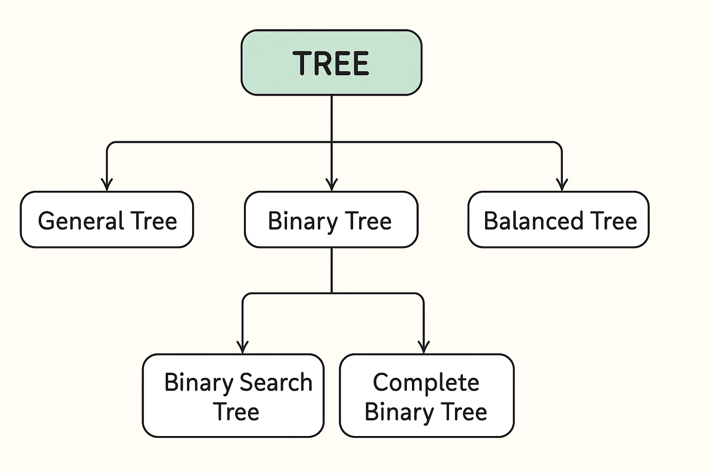

# 💡Tree

## 🍃 شو يعني tree ؟
أمثل الـ Data ع شكل node وكل node بنبثق منها مجموعة من الـ nodes  
A tree is a hierarchical, non-linear data structure.

---
##🍃 ليش اسمها TREE ؟ 
لانه شكلها فعليا متل الشجرة 
Root / Branches / Leaves

---

## 🍃 مصطلحات اساسية لازم تكون بتعرفها 

### ⭐ Root (الجذر)

أول (Node) بالشجرة.

منها ببدا كل إشي.

ما إلها اب (Parent).

### ⭐ Node (العقدة)

وحدة أساسية في الشجرة.

بتحتوي على قيمة (Data).

ممكن يكون إلها أبناء (Children).

### ⭐ Parent (الأب)

كل node إلها parent واحد (ما عدا الـ Root).

### ⭐ Child (الإبن)

node متصلة مباشرةً parent .

### ⭐ Leaf (ورقة)

node ما إلها children 

### ⭐ Siblings (إخوة)

node إلها نفس parent.

### ⭐ Height (الارتفاع)

أطول مسار من الـ Root ل leaf.

### ⭐ Depth (العمق)

عدد الحواف (Edges) من الـ Root ل node معيّنة

### ⭐ Subtree (شجرة فرعية)

أي node مع كل children تحتها تعتبر Subtree.

---

## 🍃 Types of trees

### ⭐ General Tree 

أي عقدة ممكن يكون إلها عدد غير محدود من الأبناء.

### ⭐ Binary Tree 

كل عقدة مسموح إلها حد أقصى ولدين (Left + Right).

أكثر نوع مشهور بالداتا ستركتشور.

### ⭐ Binary Search Tree (BST)

نفس الـ Binary Tree بس بترتيب خاص:

القيم الأصغر من الأب → تروح يسار.

القيم الأكبر من الأب → تروح يمين.

بيخلي البحث أسرع.

### ⭐ Balanced Trees (متل  AVL, Red-Black Tree)

أشجار ثنائية بس متوازنة حتى ما يصير ميلان لطرف واحد.

مفيدة بالبحث السريع.

### ⭐ Heap Tree

نوع خاص من Binary Tree يستخدم بعمليات الـ Priority Queue.
